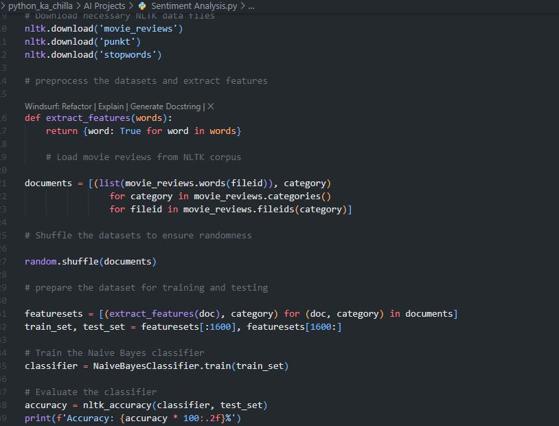
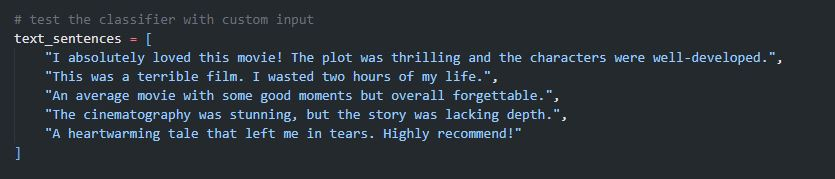

# 🎬 Movie Reviews Sentiment Analysis with NLTK 🤖  
    

<p align="center">
  
</p>

🚀 This project builds a **Naive Bayes classifier** using **NLTK** to perform sentiment analysis on movie reviews. It trains on the popular `movie_reviews` corpus, extracts word features, and predicts whether a review is positive or negative. The model also reveals the most informative words for classification.

---

## ✨ Key Features  
🎥 **Movie Reviews Corpus** – Uses NLTK's built‑in movie reviews dataset  
🧠 **Naive Bayes Classifier** – Simple yet effective probabilistic model  
📊 **Model Evaluation** – Accuracy on a held‑out test set  
🔍 **Most Informative Features** – Displays top words influencing sentiment  
📝 **Custom Prediction** – Test your own sentences with the trained model  

---

## 🧠 Tech Stack  
- **Language:** Python 🐍  
- **Library:** NLTK (Natural Language Toolkit)  
- **Model:** Naive Bayes  
- **Dataset:** `movie_reviews` from NLTK corpus  

---

## 📦 Installation  

```bash
git clone https://github.com/SayabArshad/Movie-Reviews-Sentiment-Analysis-NLTK.git
cd Movie-Reviews-Sentiment-Analysis-NLTK
pip install nltk
```

⚙️ Note: The first run will download necessary NLTK data (movie_reviews, punkt, stopwords).

---

## ▶️ Usage

Run the main script:

```bash
python "Sentiment Analysis.py"
```

The script will:

Download required NLTK resources.

Load and shuffle the movie reviews.

Extract features (presence of words).

Train a Naive Bayes classifier on 1600 reviews.

Print accuracy on the remaining test reviews.

Show the 10 most informative features (words).

Test the classifier on five custom sentences and print their predicted sentiment.

---

## 📁 Project Structure

```
Movie-Reviews-Sentiment-Analysis-NLTK/
│-- Sentiment Analysis.py        
│-- README.md                     
│-- assets/                     
│    ├── code.JPG
│    ├── input.JPG
│    └── sentiment analysis output.JPG
```
---

## 🖼️ Interface Previews


| 📝 Code Snippet | 📊 Console Output |
|:---------------:|:-----------------:|
|  |  |

## 📝 Custom Input Sentences

.

---


## 💡 About the Project

Sentiment analysis is a fundamental NLP task that determines the emotional tone of a text. This project uses the movie_reviews corpus, which contains 2000 labeled reviews (1000 positive, 1000 negative). After preprocessing (tokenization, stopword removal), the presence of each word is used as a binary feature. A Naive Bayes classifier is trained on 1600 reviews and tested on the remaining 400, achieving around 73% accuracy. The model also identifies the most informative words – e.g., "insulting" strongly indicates negative sentiment, while "outstanding" indicates positive. You can also input your own sentences to see how the model classifies them.

---

## 🧑‍💻 Author


**Developed by:** [Sayab Arshad Soduzai](https://github.com/SayabArshad) 👨‍💻

📅 **Version:** 1.0.0

📜 **License:** MIT License

---

## ⭐ Contributions

Contributions are welcome! Fork the repository, open issues, or submit pull requests to enhance functionality (e.g., improving preprocessing, trying other classifiers, or building a web interface).
If you find this project helpful, please ⭐ star the repository to show your support.

---

## 📧 Contact

For queries, collaborations, or feedback, reach out at **[sayabarshad789@gmail.com](mailto:sayabarshad789@gmail.com)**

---

🎬 Decoding movie emotions, one review at a time.

---
